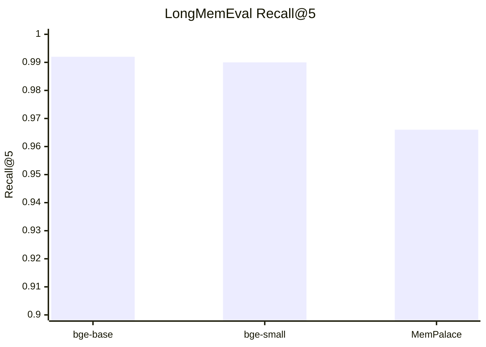
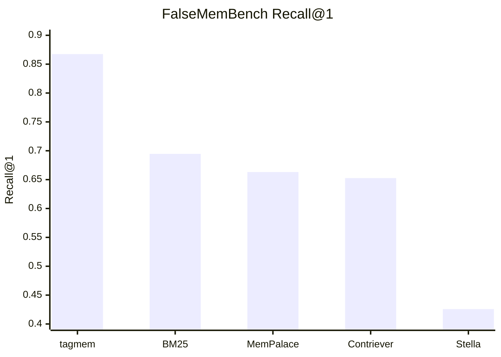
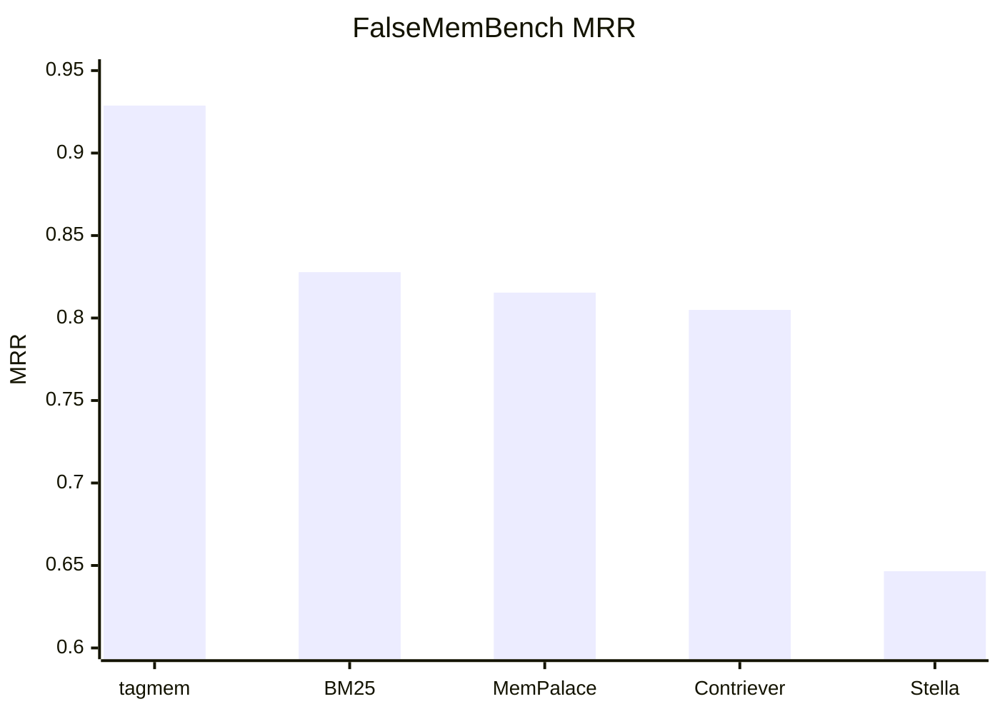

<p align="center">
  
</p>

# tagmem

**Deterministic local memory for LLM agents.**

`tagmem` is a local-first memory system that stores original text, retrieves it with hybrid semantic and lexical ranking, and exposes that memory through a simple CLI and MCP interface.

[Install](#install) · [MCP](#mcp) · [Benchmarks](#benchmarks) · [Configuration](#configuration) · [Fact rubric](FACT_RUBRIC.md) · [Install guide](INSTALL.md)

## Quick Start

Install `tagmem` with one command:

```bash
curl -fsSL https://raw.githubusercontent.com/codysnider/tagmem/main/scripts/install.sh | bash
```

For a detailed installation guide, see [`INSTALL.md`](INSTALL.md).

## Why tagmem

`tagmem` is built for teams and individuals who want memory behavior they can inspect, reproduce, and trust.

- **Verbatim source retrieval**: original source material stays retrievable with each memory ([verification](VERBATIM_SOURCE.md))
- **Deterministic retrieval**: hybrid semantic + keyword ranking with predictable behavior
- **Structured facts and timelines**: a small knowledge graph supports exact current-state and historical queries ([details](KNOWLEDGE_GRAPH.md))
- **Local-first**: runs locally with Docker using dedicated CPU and GPU images
- **Clear organization**: tags are primary, depth is secondary
- **Reproducible evaluation**: benchmark methodology and raw outputs are published in the repo ([report](benchmarks/REPORT.md))

## Install

Published images:

```bash
ghcr.io/codysnider/tagmem:latest-cpu
ghcr.io/codysnider/tagmem:latest-gpu
```

After installation, just use `tagmem`.

Local storage is created automatically on first use.

The installer chooses `latest-gpu` when the GPU image validates successfully on an NVIDIA host. Otherwise it installs wrappers for `latest-cpu`.

If OpenCode is detected during an interactive install and its config is patchable, the installer can offer to add the `tagmem` MCP entry.

## Compatibility

| Environment | Docker CPU | Docker GPU | Source build | Status |
|---|---|---|---|---|
| Linux amd64 with NVIDIA GPU | ✓ | ✓ | ✓ | Supported |
| Linux amd64 without NVIDIA GPU | ✓ | X | ✓ | Supported |
| Linux arm64 | Planned | X | Planned | Planned |
| macOS Intel | Planned | X | Planned | Planned |
| macOS Apple Silicon | Planned | X | Planned | Planned |
| Windows x86_64 | Planned | X | Planned | Planned |

`Source build` means compiling from the repository yourself. The simple installer path is Docker-only for now.

Add an entry:

```bash
tagmem add --depth 0 --title "identity" --body "You are building a local memory system."
```

Search:

```bash
tagmem search "identity"
tagmem search --depth 2 "auth migration"
tagmem search --tag auth "token refresh"
tagmem search --explain "What database does staging use?"
```

## Core Model

`tagmem` uses a simple memory model:

- **entries** store searchable body text plus retrievable verbatim source material
- **tags** provide primary organization and filtering
- **depth** acts as a closeness and retrieval-priority signal
- **facts** store structured knowledge
- **diary** stores agent-specific notes

This keeps the memory layer understandable while still supporting richer retrieval behavior.

For a practical rule set on when text should stay an entry, become a fact, or both, see [`FACT_RUBRIC.md`](FACT_RUBRIC.md). For the graph model and query semantics, see [`KNOWLEDGE_GRAPH.md`](KNOWLEDGE_GRAPH.md).

## Commands

Core commands:

- `tagmem init`
- `tagmem ingest`
- `tagmem split`
- `tagmem add`
- `tagmem list`
- `tagmem search`
- `tagmem show`
- `tagmem status`
- `tagmem context`
- `tagmem depths`
- `tagmem paths`
- `tagmem doctor`
- `tagmem repair`
- `tagmem mcp`
- `tagmem bench`

`tagmem init` remains available as an optional bootstrap command if you want to precreate storage and print the resolved paths.

Examples:

```bash
tagmem ingest --mode files --depth 1 ~/projects/my_app
tagmem ingest --mode conversations --depth 2 ~/chats
tagmem ingest --mode conversations --extract general ~/chats
tagmem split ~/chats
tagmem status
tagmem context --depth 0
tagmem context --tag auth
tagmem show 1
```

## MCP

Run the MCP server over stdio:

```bash
tagmem mcp
```

Current MCP tools:

- `tagmem_status`
- `tagmem_paths`
- `tagmem_list_depths`
- `tagmem_list_tags`
- `tagmem_get_tag_map`
- `tagmem_list_entries`
- `tagmem_search`
- `tagmem_fact_rubric`
- `tagmem_show_entry`
- `tagmem_check_duplicate`
- `tagmem_add_entry`
- `tagmem_delete_entry`
- `tagmem_kg_query`
- `tagmem_kg_add`
- `tagmem_kg_invalidate`
- `tagmem_kg_timeline`
- `tagmem_kg_stats`
- `tagmem_graph_traverse`
- `tagmem_find_bridges`
- `tagmem_graph_stats`
- `tagmem_diary_write`
- `tagmem_diary_read`
- `tagmem_doctor`

## Benchmarks

Current benchmark snapshot:

### LongMemEval

Latest release-check confirmation for the default embedded model (`bge-small-en-v1.5`, ONNX/CUDA):



- `tagmem` (`bge-small-en-v1.5`): `Recall@1 0.924`, `Recall@5 0.990`, `MRR 0.955`
- `tagmem` (`bge-base-en-v1.5`): `Recall@1 0.922`, `Recall@5 0.992`, `MRR 0.953`
- MemPalace raw baseline: `Recall@5 0.966`

The latest guarded rerun for `bge-small-en-v1.5` also recorded `Recall@10 0.996`, `NDCG@10 0.951`, and `Time 23.4s`.

### FalseMemBench

`FalseMemBench` is a standalone adversarial distractor benchmark focused on conflicting, stale, and near-miss memories.





- `tagmem`: `Recall@1 0.8674`, `Recall@5 0.9983`, `MRR 0.9288`
- `BM25`: `Recall@1 0.6946`, `Recall@5 0.9930`, `MRR 0.8278`
- MemPalace raw-style: `Recall@1 0.6632`, `Recall@5 0.9948`, `MRR 0.8154`
- `Contriever`: `Recall@1 0.6527`, `Recall@5 0.9843`, `MRR 0.8049`
- `Stella`: `Recall@1 0.4258`, `Recall@5 0.9791`, `MRR 0.6465`

For methodology, machine specs, and raw benchmark outputs, see:

- [`benchmarks/README.md`](benchmarks/README.md)
- [`benchmarks/REPORT.md`](benchmarks/REPORT.md)
- [`benchmarks/METHODOLOGY.md`](benchmarks/METHODOLOGY.md)

## Configuration

### Embedded

Default embedded configuration:

```bash
export TAGMEM_EMBED_PROVIDER=embedded
export TAGMEM_EMBED_MODEL=bge-small-en-v1.5
export TAGMEM_EMBED_ACCEL=auto
```

### OpenAI-compatible

```bash
export TAGMEM_EMBED_PROVIDER=openai
export TAGMEM_OPENAI_MODEL=nomic-embed-text
export TAGMEM_OPENAI_BASE_URL=http://localhost:11434/v1
export TAGMEM_OPENAI_API_KEY=
```

### Environment variables

| Variable | Default | Purpose |
|---|---|---|
| `TAGMEM_EMBED_PROVIDER` | `embedded` | Selects the embedding backend: `embedded`, `openai`, or `embedded-hash`. |
| `TAGMEM_EMBED_MODEL` | `bge-small-en-v1.5` | Selects the embedded local model. |
| `TAGMEM_EMBED_ACCEL` | `auto` | Embedded acceleration mode: `auto`, `cuda`, or `cpu`. |
| `TAGMEM_OPENAI_MODEL` | `nomic-embed-text` | Model name for OpenAI-compatible embeddings. |
| `TAGMEM_OPENAI_BASE_URL` | unset | Base URL for an OpenAI-compatible embeddings endpoint. |
| `TAGMEM_OPENAI_API_KEY` | unset | API key for an OpenAI-compatible endpoint. |
| `TAGMEM_DATA_ROOT` | `$HOME/.local/share/tagmem` | Host-side root directory for Docker state, datasets, and benchmark outputs. |
| `TAGMEM_BENCH_ROOT` | Docker-only | Root path for benchmark outputs in the Docker workflow. |
| `TAGMEM_DATASET_ROOT` | Docker-only | Root path for benchmark datasets in the Docker workflow. |
| `XDG_CONFIG_HOME` | platform default | XDG config root used for config and identity files. |
| `XDG_DATA_HOME` | platform default | XDG data root used for storage, vectors, facts, diary, and models. |
| `XDG_CACHE_HOME` | platform default | XDG cache root. |

## Storage Layout

- data: `~/.local/share/tagmem/store.json`
- vector index: `~/.local/share/tagmem/vector/`
- knowledge graph: `~/.local/share/tagmem/knowledge.json`
- diaries: `~/.local/share/tagmem/diaries/`
- models: `~/.local/share/tagmem/models/`
- config: `~/.config/tagmem/`
- cache: `~/.cache/tagmem/`
