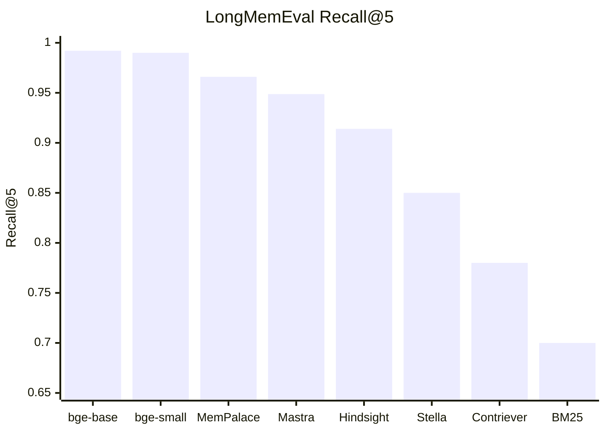
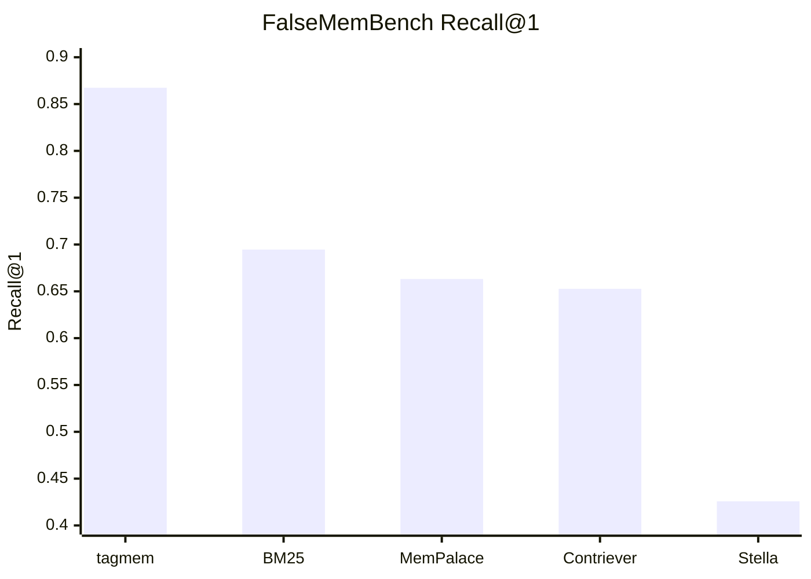
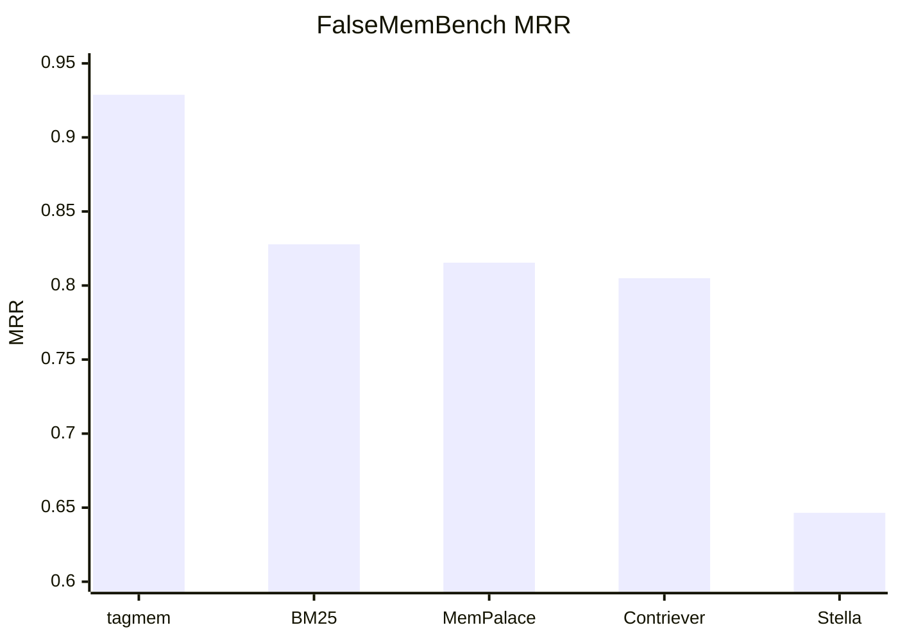

<p align="center">
  
</p>

# tagmem

Tagged, depth-aware memory storage and retrieval for LLM agents.

[Install](#install) · [OpenCode](#opencode) · [MCP](#mcp) · [Benchmarks](#benchmarks) · [Full install guide](INSTALL.md)

## Quick Start

Install with one command:

```bash
curl -fsSL https://raw.githubusercontent.com/codysnider/tagmem/main/scripts/install.sh | bash
```

This installer is:

- interactive by default
- Docker-first
- release-binary fallback when Docker is unavailable
- able to patch OpenCode config safely with backups

For full installation details, see [`INSTALL.md`](INSTALL.md).

It is built around a simple model:

- `entries` store verbatim text
- `tags` are the primary way to organize and filter memory
- `depth` indicates how close a memory should stay to the surface
- `facts` store structured knowledge
- `diary` stores agent-specific notes

The system is local-first, retrieval-oriented, and designed to be usable through:

- CLI
- MCP

## Install

Published image:

```bash
ghcr.io/codysnider/tagmem:latest
```

After install, initialize storage:

```bash
tagmem init
```

Add an entry:

```bash
tagmem add --depth 0 --title "Working identity" --body "You are helping ship a local-first memory system."
```

Search:

```bash
tagmem search "identity"
tagmem search --depth 2 "auth migration"
tagmem search --tag auth "token refresh"
```

## OpenCode

The installer can detect and patch OpenCode automatically.

If you want to patch OpenCode during install:

```bash
curl -fsSL https://raw.githubusercontent.com/codysnider/tagmem/main/scripts/install.sh | bash -s -- --patch-opencode
```

If you want to skip patching and handle config yourself:

```bash
curl -fsSL https://raw.githubusercontent.com/codysnider/tagmem/main/scripts/install.sh | bash -s -- --no-patch-opencode
```

## Runtime Notes

The Docker path keeps model files, cache, and runtime state outside the repo in mounted directories.

Default Docker data root:

```bash
$HOME/.local/share/tagmem
```

Override it if you want Docker state elsewhere:

```bash
export TAGMEM_DATA_ROOT=/path/to/tagmem-data
```

The helper `just` commands are for development and release work. Most users only need the installer.

## Commands

Core commands:

- `tagmem init`
- `tagmem ingest`
- `tagmem split`
- `tagmem add`
- `tagmem list`
- `tagmem search`
- `tagmem show`
- `tagmem status`
- `tagmem context`
- `tagmem depths`
- `tagmem paths`
- `tagmem doctor`
- `tagmem repair`
- `tagmem mcp`
- `tagmem bench`

Examples:

```bash
tagmem ingest --mode files --depth 1 ~/projects/my_app
tagmem ingest --mode conversations --depth 2 ~/chats
tagmem ingest --mode conversations --extract general ~/chats
tagmem split ~/chats
tagmem status
tagmem context --depth 0
tagmem context --tag auth
tagmem show 1
```

## MCP

Run the MCP server over stdio:

```bash
tagmem mcp
```

Current MCP tools:

- `tagmem_status`
- `tagmem_paths`
- `tagmem_list_depths`
- `tagmem_list_tags`
- `tagmem_get_tag_map`
- `tagmem_list_entries`
- `tagmem_search`
- `tagmem_show_entry`
- `tagmem_check_duplicate`
- `tagmem_add_entry`
- `tagmem_delete_entry`
- `tagmem_kg_query`
- `tagmem_kg_add`
- `tagmem_kg_invalidate`
- `tagmem_kg_timeline`
- `tagmem_kg_stats`
- `tagmem_graph_traverse`
- `tagmem_find_bridges`
- `tagmem_graph_stats`
- `tagmem_diary_write`
- `tagmem_diary_read`
- `tagmem_doctor`

## Embedding Backends

### Embedded

The embedded backend runs locally.

Default embedded configuration:

```bash
export TAGMEM_EMBED_PROVIDER=embedded
export TAGMEM_EMBED_MODEL=bge-small-en-v1.5
export TAGMEM_EMBED_ACCEL=auto
```

### OpenAI-compatible

```bash
export TAGMEM_EMBED_PROVIDER=openai
export TAGMEM_OPENAI_MODEL=nomic-embed-text
export TAGMEM_OPENAI_BASE_URL=http://localhost:11434/v1
export TAGMEM_OPENAI_API_KEY=
```

## Environment Variables

| Variable | Default | Purpose |
|---|---|---|
| `TAGMEM_EMBED_PROVIDER` | `embedded` | Selects the embedding backend: `embedded`, `openai`, or `embedded-hash`. |
| `TAGMEM_EMBED_MODEL` | `bge-small-en-v1.5` | Selects the embedded local model. Supported values currently include `all-MiniLM-L6-v2`, `bge-small-en-v1.5`, and `bge-base-en-v1.5`. |
| `TAGMEM_EMBED_ACCEL` | `auto` | Embedded acceleration mode: `auto`, `cuda`, or `cpu`. |
| `TAGMEM_OPENAI_MODEL` | `nomic-embed-text` | Model name for OpenAI-compatible embeddings. |
| `OPENAI_MODEL` | unset | Fallback model name for OpenAI-compatible mode. |
| `TAGMEM_OPENAI_BASE_URL` | unset | Base URL for an OpenAI-compatible embeddings endpoint. If no path is provided, `/v1` is assumed. |
| `OPENAI_BASE_URL` | unset | Fallback base URL for OpenAI-compatible mode. |
| `OLLAMA_HOST` | unset | Convenience fallback base URL, normalized to `/v1` if used. |
| `TAGMEM_OPENAI_API_KEY` | unset | API key for an OpenAI-compatible endpoint. |
| `OPENAI_API_KEY` | unset | Fallback API key for OpenAI-compatible mode. |
| `TAGMEM_DATA_ROOT` | `$HOME/.local/share/tagmem` | Host-side root directory for Docker state, including XDG data, model caches, datasets, and benchmark results. |
| `TAGMEM_BENCH_ROOT` | Docker-only | Root path for benchmark outputs in the Docker workflow. |
| `TAGMEM_DATASET_ROOT` | Docker-only | Root path for benchmark datasets in the Docker workflow. |
| `XDG_CONFIG_HOME` | platform default | XDG config root used for config and identity files. |
| `XDG_DATA_HOME` | platform default | XDG data root used for storage, vectors, knowledge graph, diaries, and models. |
| `XDG_CACHE_HOME` | platform default | XDG cache root. |

## Storage Layout

- data: `~/.local/share/tagmem/store.json`
- vector index: `~/.local/share/tagmem/vector/`
- knowledge graph: `~/.local/share/tagmem/knowledge.json`
- diaries: `~/.local/share/tagmem/diaries/`
- models: `~/.local/share/tagmem/models/`
- config: `~/.config/tagmem/`
- cache: `~/.cache/tagmem/`

`tagmem` is local-first, keeps original text intact, avoids lossy memory dialects, and uses simple user-facing concepts: entries, tags, depth, facts, and diary.

## Benchmarks

Current benchmark snapshot:

### LongMemEval Comparison



- `tagmem` (`bge-small-en-v1.5`): `Recall@1 0.924`, `Recall@5 0.990`, `MRR 0.955`
- `tagmem` (`bge-base-en-v1.5`): `Recall@1 0.922`, `Recall@5 0.992`, `MRR 0.953`
- MemPalace raw baseline: `Recall@5 0.966`
- Source-reported comparisons from MemPalace docs: `Mastra 0.9487`, `Hindsight 0.914`, `Stella ~0.85`, `Contriever ~0.78`, `BM25 ~0.70`

### Adversarial Retrieval Snapshot

`FalseMemBench` is a standalone adversarial distractor benchmark focused on conflicting, stale, and near-miss memories.





- `tagmem`: `Recall@1 0.8674`, `Recall@5 0.9983`, `MRR 0.9288`
- `BM25`: `Recall@1 0.6946`, `Recall@5 0.9930`, `MRR 0.8278`
- MemPalace raw-style: `Recall@1 0.6632`, `Recall@5 0.9948`, `MRR 0.8154`
- `Contriever`: `Recall@1 0.6527`, `Recall@5 0.9843`, `MRR 0.8049`
- `Stella`: `Recall@1 0.4258`, `Recall@5 0.9791`, `MRR 0.6465`

### Current GPU Model Snapshot

| Model | LongMemEval R@5 | LongMemEval Time | LoCoMo Avg Recall | MemBench R@5 | ConvoMem Avg Recall |
|---|---:|---:|---:|---:|---:|
| `all-MiniLM-L6-v2` | 0.982 | 14.4s | 0.915 | 0.778 | 0.931 |
| `bge-small-en-v1.5` | 0.990 | 23.0s | 0.941 | 0.804 | 0.898 |
| `bge-base-en-v1.5` | 0.992 | 44.1s | 0.949 | 0.802 | 0.920 |

For methodology, machine specs, charts, and raw JSON outputs, see:

- [`benchmarks/README.md`](benchmarks/README.md)
- [`benchmarks/REPORT.md`](benchmarks/REPORT.md)
- [`benchmarks/METHODOLOGY.md`](benchmarks/METHODOLOGY.md)
- [`benchmarks/MEMPALACE-COMPARISON.md`](benchmarks/MEMPALACE-COMPARISON.md)
