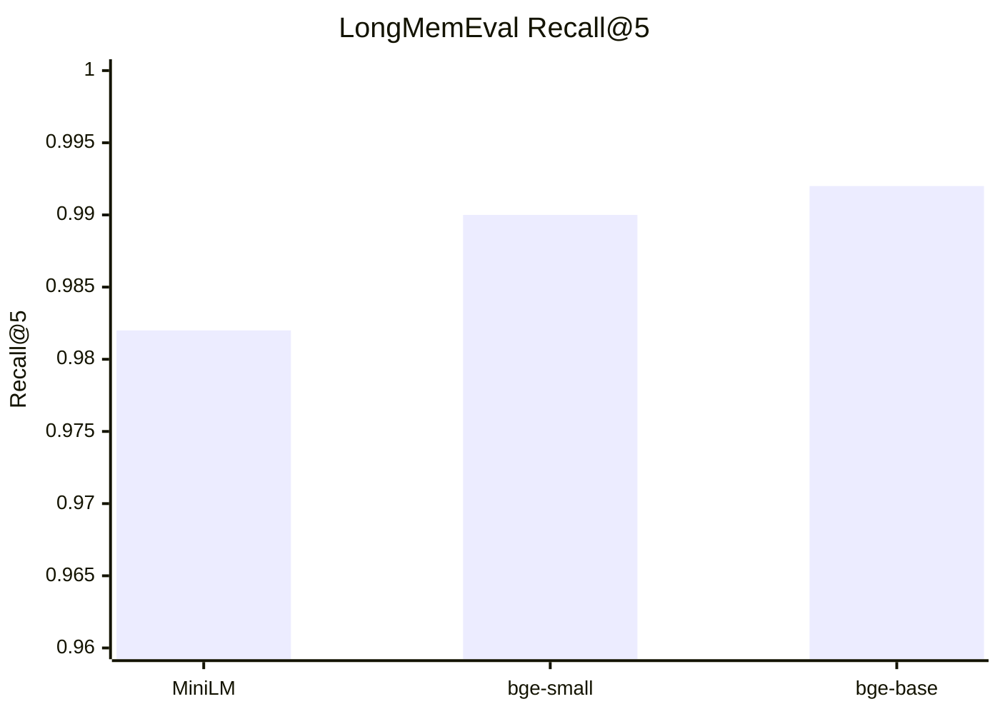
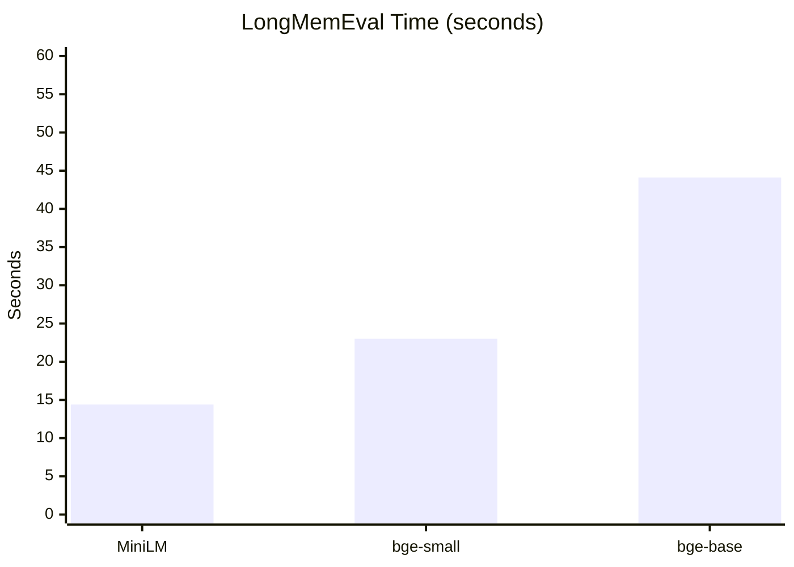
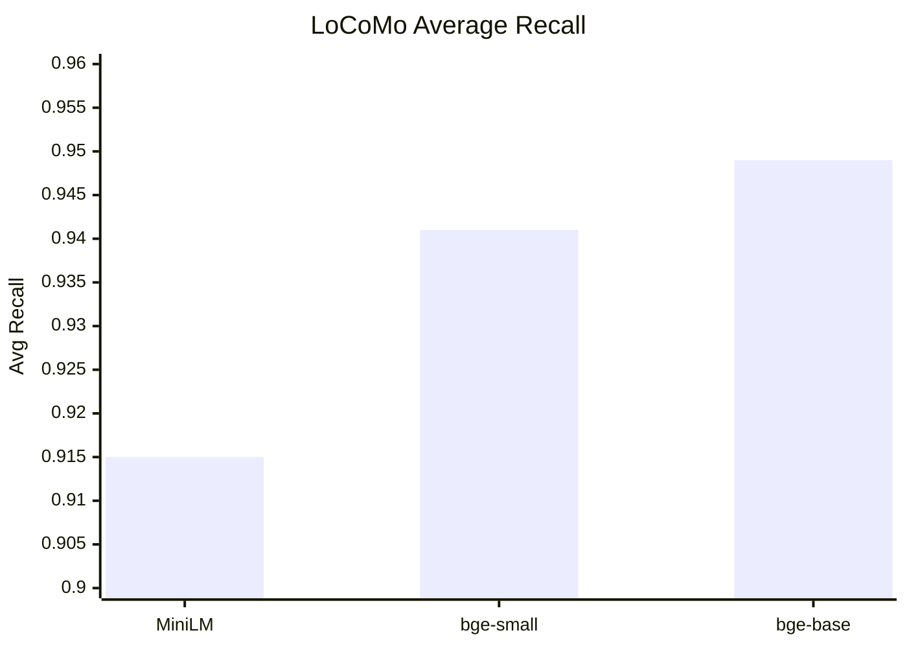
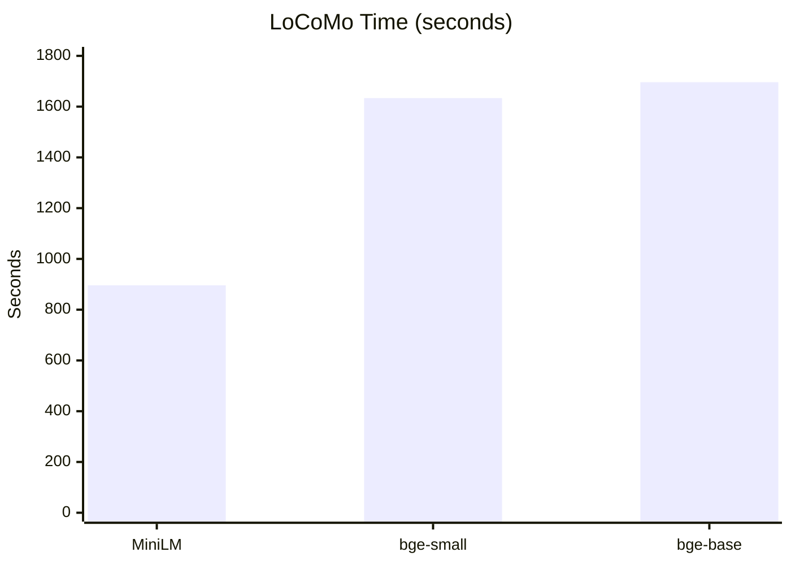
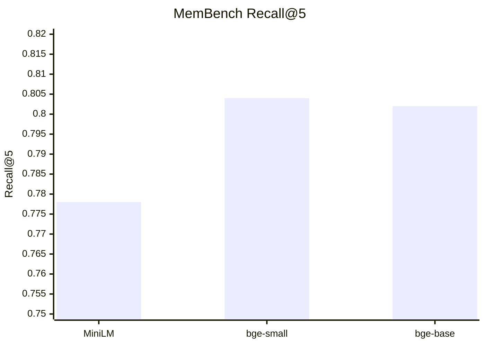
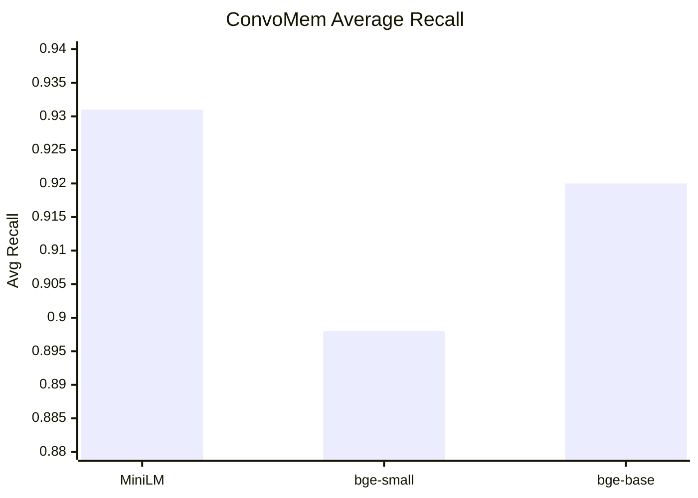
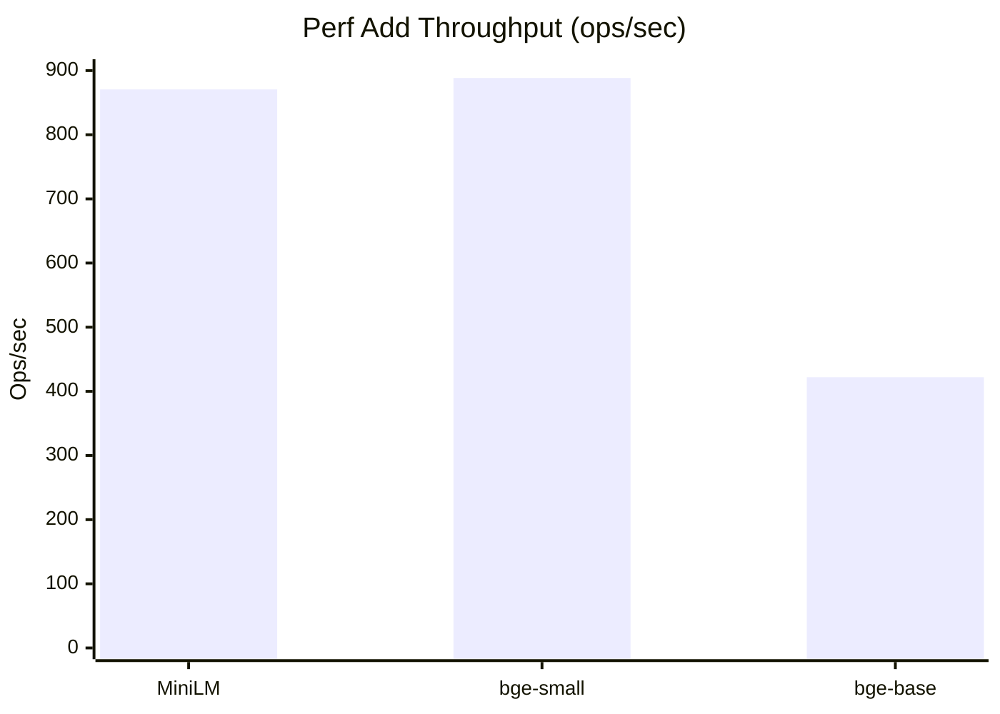
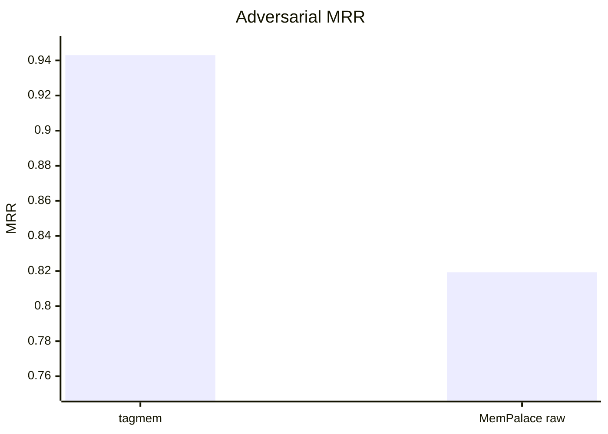

# Benchmark Charts

GitHub-friendly Mermaid charts generated from the raw benchmark outputs.

## LongMemEval Recall@5



## LongMemEval Time



## LoCoMo Average Recall



## LoCoMo Time



## MemBench Recall@5



## ConvoMem Average Recall



## Add Throughput



## Search Throughput

```mermaid
xychart-beta
    title "Perf Search Throughput (ops/sec)"
    x-axis ["MiniLM", "bge-small", "bge-base"]
    y-axis "Ops/sec" 0 --> 1700
    bar [1616.44, 451.36, 1575.09]

## Adversarial Recall@1

```mermaid
xychart-beta
    title "Adversarial Recall@1"
    x-axis ["tagmem", "MemPalace raw"]
    y-axis "Recall@1" 0.60 --> 0.90
    bar [0.8860, 0.6600]
```

## Adversarial MRR


```
